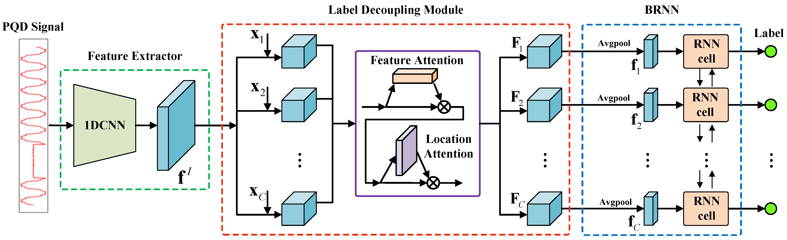

# LGAN for PQD Multilabel Classification
Implementation of the paper: A Novel Label-guided Attention Method for Multilabel Classification of Multiple Power Quality Disturbances
[here](https://ieeexplore.ieee.org/document/9558707)

## Environment
Python 3.7  
Pytorch 1.8.1 GPU  
tensorflow 2.1.0 GPU  
scikit-learn 0.22.1  
scikit-multilearn  

## framework of LGAN

## Datasets && trained Models 
You can download the data files and our trained models [here](https://pan.baidu.com/s/114NdUrJpjvqXlSUZhuhtPw)
password: 0i5r

## Result
CNN models:

|Method| ML-CNN| MC-CNN |DCNN|CNN-LSTM|***LGAN***|
|---------|-------|-------|---------|-------|-------|
|accuracy| 98.43|98.49|98.62|98.00|***99.17***|

Multilabel methods:

|Method |MLKNN|MLHARAM|BPMLL|CNN_BPMLL|***LGAN***|
|---------|-------|-------|---------|--|-------|
|hamming loss| 0.1146|0.1474|0.0645|0.0028|***0.0013***|

## Project index description
project  
| datasets -- train and test data   
| model -- trained model files  
| model_struct -- save the model struct(.onnx)  
| network -- model creat  
| ____ cnn_atten_rnn.py -- LGAN  
| ____ mc_cnn.py -- MC-CNN, DCNN, and CNN-LSTM  
| ____ ml_cnn.py -- ML-CNN  
| utils -- dataload, metrics define and loss function   
| bpmll_train.py -- train BPMLL and CNN-BPMLL  
| cnn_atten_rnn_train.py -- train LGAN  
| mc_cnn_train.py -- train MC-CNN, DCNN, and CNN-LSTM  
| ml_cnn_train.py -- train ML-CNN  
| skmlmodel -- train and test MLKNN, MLHARAM  
| model_test.py -- test LGAN, ML-CNN, MC-CNN, DCNN, and CNN-LSTM  
| README.md

